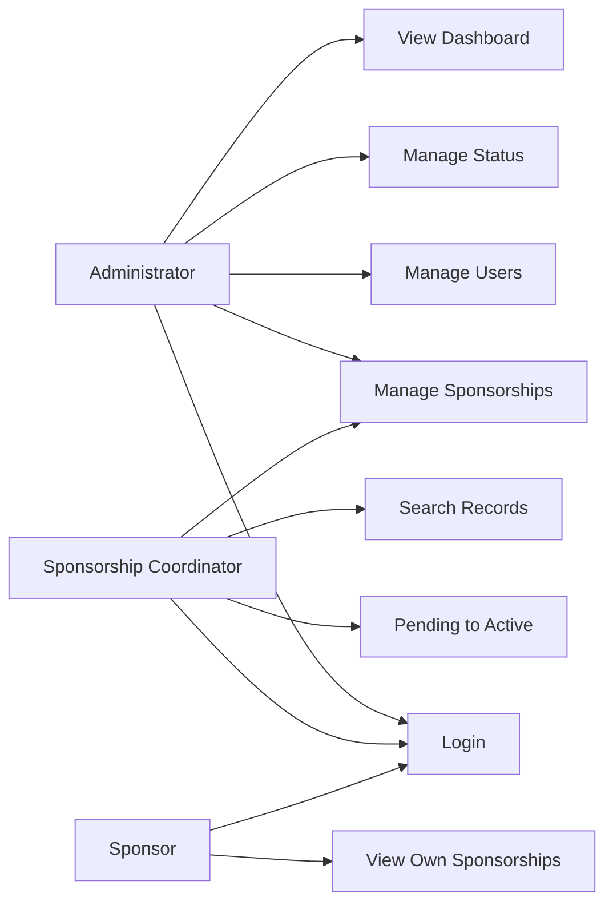

# Use-Case Model

## Actors
Administrator, Sponsorship Coordinator, Sponsor

## Use Cases
Administrator:
- Login
- Create users
- Manage sponsorships
- Manage statuses
- View dashboard

Coordinator:
- Login
- Create sponsorship
- View sponsorship
- Update sponsorship
- Search sponsorship
- Pending → Active

Sponsor:
- Login
- View own sponsorship records

## Mermaid Diagram

